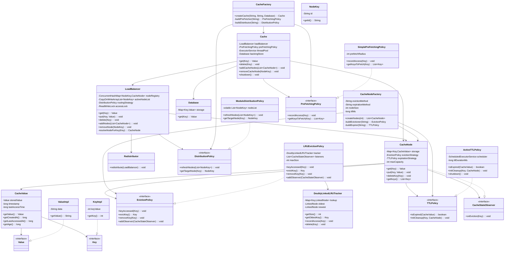

# Distributed In-Memory Cache System

A Java-based system design project implementing a scalable distributed caching mechanism. This implementation demonstrates multi-node cache cluster operations, cache miss resolution through a persistence layer, and industry-standard optimization techniques including LRU memory management, time-based expiration, and intelligent data prefetching.

This project serves as an educational resource for understanding distributed systems architecture, highlighting how independent cache components integrate seamlessly through well-defined interfaces.

---

## System Characteristics

The cache infrastructure supports:

- Linear growth through additional cache nodes
- Interchangeable implementations for routing, memory management, expiration, and prediction
- Reliable request handling with intelligent node selection
- Automatic cluster rebalancing on topology modifications

Please note: This is an educational architecture demonstrating design patterns, not production-grade software.

---

## System Design

### Request Processing Pipeline

1. Client initiates data retrieval through Cache.get(key)
2. LoadBalancer determines destination node via DistributionPolicy
3. Target CacheNode is queried for requested key:
   - Found → Serve cached result immediately
   - Missing → Query Database, persist to node, return result
4. PerFetchingPolicy triggers asynchronous retrieval of anticipated keys
5. Node-level enforcement mechanisms:
   - Storage utilization controlled by EvictionPolicy
   - Temporal validity managed by TTLPolicy
6. During cluster configuration adjustments:
   - LoadBalancer recalculates shard distribution
   - Redistributor transfers keys to correct locations

---

## Standard Deployment Settings

Current implementation leverages:

| Module               | Implementation                               |
| -------------------- | -------------------------------------------- |
| Key Distribution     | Modular arithmetic-based sharding            |
| Space Management     | Least-Recently-Used removal protocol         |
| Lifetime Enforcement | Scheduled background cleanup                 |
| Intelligent Loading  | Proximity-based key prediction               |
| Storage Backend      | In-process repository with synthetic latency |

---

## Primary Building Blocks

### Primary Services

- **Cache**

  Orchestrates all cache interactions, manages node selection, handles database queries, triggers background data preparation.

- **CacheNode**

  Encapsulates a distributed cache segment with attached management strategies and local data structures.

- **LoadBalancer**

  Implements intelligent key distribution, directs requests to assigned nodes using configured algorithms.

- **Redistributor**

  Manages data migrations during cluster topology transitions.

### Policy Interfaces (Extensible Implementations)

- **DistributionPolicy**

  Specifies algorithm for key-to-node allocation
  (e.g., hash-based modulo arithmetic)

- **EvictionPolicy**

  Enforces storage boundaries through data removal
  (e.g., temporal recency tracking)

- **TTLPolicy**

  Manages cache entry lifecycle and removal timing

- **PreFetchingPolicy**

  Implements predictive loading of correlated data

### Secondary Services

- **Database**

  Persistent data source with engineered access delays to simulate real scenarios

- **Component Builders**
  - CacheFactory
  - CacheNodeFactory

  Enable flexible construction of system architecture without tight coupling

- **Data Models**

  Abstract key and value representations with associated metadata

- **Event System**
  - CacheStateObserver
  Provides extensibility hooks for state monitoring and reactions

---

## Low-Level Design (UML)



---

## Directory Organization

```
src/main/java/com/cache/
├── Main.java                              // System bootstrap, initializes and executes demonstration
├── core/
│   ├── Cache.java                         // Central coordinator for cache functionality (retrieval, persistence, data preparation)
│   ├── CacheNode.java                     // Single cache partition with attached algorithms (storage + memory management + expiration)
│   ├── LoadBalancer.java                  // Request distribution engine implementing routing algorithms
│   └── Redistributor.java                 // Handles key relocation during topology changes
├── database/
│   └── Database.java                      // Backing storage layer with configurable response delay
├── factory/
│   ├── CacheFactory.java                  // Configures and instantiates Cache with strategy selection
│   └── CacheNodeFactory.java              // Generates cache partitions with integrated policies
├── model/
│   ├── CacheValue.java                    // Stored entry container with timestamp information
│   ├── Key.java                           // Key interface specification
│   ├── KeyImpl.java                       // Key concrete implementation
│   ├── NodeKey.java                       // Node identification mechanism
│   ├── Value.java                         // Value interface specification
│   └── ValueImpl.java                     // Value concrete implementation
├── observer/
│   └── CacheStateObserver.java            // Event notification interface for state transitions
└── strategy/
    ├── distribution/
    │   ├── DistributionPolicy.java        // Algorithm interface for key allocation
    │   └── ModuloDistributionPolicy.java  // Hash-modulo based node assignment
    ├── eviction/
    │   ├── EvictionPolicy.java            // Storage constraint enforcement interface
    │   └── LRUEvictionPolicy.java         // Recency-based eviction implementation
    ├── prefetching/
    │   ├── PreFetchingPolicy.java         // Predictive loading interface
    │   └── SimplePreFetchingPolicy.java   // Proximity-based prefetch strategy
    └── timetolive/
        ├── ActiveTTLPolicy.java           // Time-based expiration with background cleanup
        └── TTLPolicy.java                 // Lifetime management interface
```

---

## 🛠️ Build & Deployment

### **1. Compilation**

```bash
javac -d out --source-path src/main/java src/main/java/com/cache/Main.java
```

### **2. Execution**

```bash
java -cp out com.cache.Main
```

> **Important:**  
> The `-d out` parameter separates compiled bytecode from source files.

---

## Capabilities

- Multi-node cache with intelligent request distribution
- Strategy-based customization through standardized interfaces
- Time-bound entry validity with scheduled removal
- Eager data preparation to boost retrieval efficiency
- Transparent key migration during cluster rescaling
- Realistic I/O simulation showcasing distributed cache advantages
